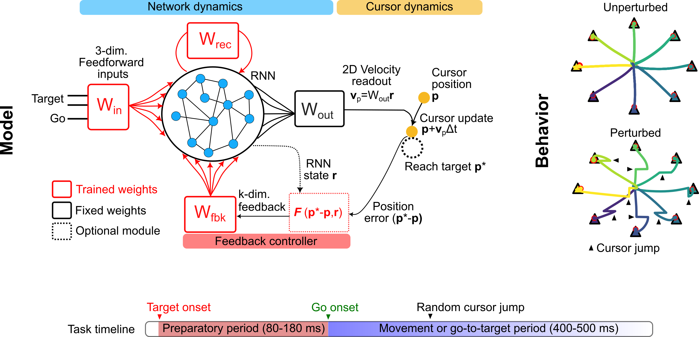

# FeedbackControlledRNN
Code to simulate BCI task and adaptation in feedback-controlled RNNs. 

Tested with Python 3.9.6 and Python 3.10.12

Accompanies the following [preprint](https://doi.org/10.1101/2024.05.24.595772):
```
Feedback control of recurrent dynamics constrains learning timescales during motor adaptation. bioRxiv 2024.
Harsha Gurnani, Weixuan Liu,  Bingni W. Brunton
doi: https://doi.org/10.1101/2024.05.24.595772
```




For details, look at:
- [Model construction](#model-construction)
- [Generating perturbed decoders](#generate-and-filter-perturbed-maps)
- [Retraining weights for adaptation to perturbed decoders](#adaptation-with-perturbed-decoders)
- [Analysis of RNN dynamics](#rnn-analysis)

## Model construction
To create and train new models, use the `scripts/batch_create_sparse.py` file. You can specify various options for construction, including foldername `-F` and number of models `-nf`. The folder will be inside [use_models/](/use_models)

**Example 1:** Simple velocity decoder
```
$ python scripts/batch_create_network.py -F 'relu_/' -nf 5 -te 400 -pe 250
```

**Example 2:** Simple position decoder
```
$ python scripts/batch_create_network.py -F 'relu_pos_/' -nf 5 -te 400 -pe 250 -decode_p 1
```

**Example 3:** Velocity decoder with 2-layer feedback controller module
```
$ python batch_create_network.py -F 'percp_expansion_/' -nf 2 -te 450 -pe 250 -lr 0.0002 -mtype 'layer2' -nout 4 -nhid 100 -nmf 10
```


## Generate and filter perturbed maps
Decide which models to use (follow [model construction](#model-construction) first), specify the dimensionality of the intrinsic manifold, and optionally specify conditions for filtering perturbed decoders:

Results are in [wmp/](/wmp/), [omp/](/omp/) or [rmp/](/rmp/). Each model file will have its own folder with filtered WMPs saved in `WMP_maps.npy` and the combined results will be in `xmp_tested_movepc_PCK.npy` where `xmp` is wmp, omp or rmp, and `PCK` specifies the intrinsic manifold dimensionality K.

**Example 1:** Generate Within-Manifold decoders

Manifold dimensionality = 8, search over 1000 WMPs:
```
$ python scripts/batch_gen_wmp.py -pc 8 -nlist 1000
```

**Example 2:** Generate Outside-Manifold decoders

Manifold dimensionality = 8, search over 1000 OMPs, open loop velocity between 0.3x-1.5x:
```
$ python scripts/batch_gen_omp.py -pc 8 -nlist 1000 -ratio0 0.3 -ratio1 1.5
```


## Adaptation with perturbed decoders
Use `scripts/batch_train_perturbation.py` for batch run.
- Specify folder (`-F`),  WMP/OMP file (`-file`), and save suffix (`-sf2`)
- Specify map type (`-map`) (WMP by default)
- Specify no. of perturbed decoders per model file (`-ntr`)
- Specify no. of repetitions with each decoder (`-nr`)
- Specify training parameters (`-te`, `-pe`)

**Example 1:** Train WMPs

Loads `wmp_tested_movepc_PC8.npy` from [wmp/relu_](/wmp/relu_/), uses 1 model file from it, trains input weights (default) for 3 maps, and saves it in [wmp/relu_/Model_XX_movePC_PC8/trained_trainInp200/](/wmp/relu_/Model_6_movePC_PC8/):
```
$ python scripts/batch_train_perturbation.py -sf2 '_trainInp200' -nf 1 -ntr 3 -te 200 -pe 200 -nr 1
```
OR Train via weight perturbation (`-twp`):
```
$ python scripts/batch_train_perturbation.py -sf2 '_trainInp200' -twp 1  -nf 1 -ntr 3 -te 200 -pe 200 -nr 1 
```

**Example 2:** Train OMPs

Loads `omp_tested_movepc_PC8.npy` from [omp/relu_](/wmp/relu_/), uses 1 model file from it, trains recurrent weights (`-rec`) for 3 maps, and saves it in [omp/relu_/Model_XX_movePC_PC8/trained_trainRec200/](/omp/relu_/Model_6_movePC_PC8/):
(Training recurrent weights automatically turns off input weights)
```
$ python scripts/batch_train_perturbation.py -map 'omp' -file 'omp_tested_movepc_PC8.npy' -rec 1 -sf2 '_trainRec200' -nf 1 -ntr 3 -te 200 -pe 200 -nr 1
```
OR for a 2-layer feedback controller, train controller output layer:
(Training controller module automatically turns off feedback weights but NOT feedforward weights)
```
$ python scripts/batch_train_perturbation.py -F 'percp2_expansion_/'  -map 'omp' -fbout 1 -file 'omp_tested_movepc_PC8.npy' -sf2 '_trainFbOut200' -nf 1 -ntr 3 -te 200 -pe 200 -nr 1
```

### Analysis of Adaptation
For a single file, use `tools.pert_analyses.get_training_results`:
```
import numpy as np
import tools.pert_analyses as pa
pa.get_training_results( file='trained_wmp_trainInp200.npy', folder='wmp/relu_/Model_6_movePC_PC8/', savfolder='saved_plots/wmp/' )
np.save( 'wmp/example_results.npy', res )
```

For multiple files, use `scripts/batch_plot_pert.py`. This combines results across files, separately for wmp and omp. The relevant options can be listed in `scripts/list_of_folders.py`. It also plots a bunch of analyses.
```
$ python scripts/batch_plot_pert.py -F 'relu_test_'
$ python scripts/batch_plot_pert.py -F 'relu_inp200'
```

## RNN Analysis

### Dynamics of error correction
Look at `tools/feedback_analysis.py`. Generates graphs for each plot_type, or for many scales.
```
import tools.feedback_analysis as fa
fa.analyse_all_files( scale=[0.1,0.3,0.5,0.8,1.0], suffix='allfiles' )
fa.analyse_all_files(plot_type='t20', suffix='allfiles')
fa.analyse_all_files(plot_type='vpeak', suffix='allfiles')
fa.analyse_all_files(plot_type='error', suffix='allfiles')
```

### Fixed points of Joint RNN-Cursor System
Look at [FixedPoint](/FixedPoint/) folder. 
```
$ python FixedPoint/example_analysis.py
```

### Latent dynamics of RNN
Look at [LDSFit](/LDSFit/) folder. Edit options within the files if you want such as:
- dimensions of latent space (`allz`)
- min performance of analyzed fits for rotational dynamics (`min_cev`)
- how many iters to fit (`iters`)
```
$ python LDSFit/batch_analyse_relu_cv.py
```